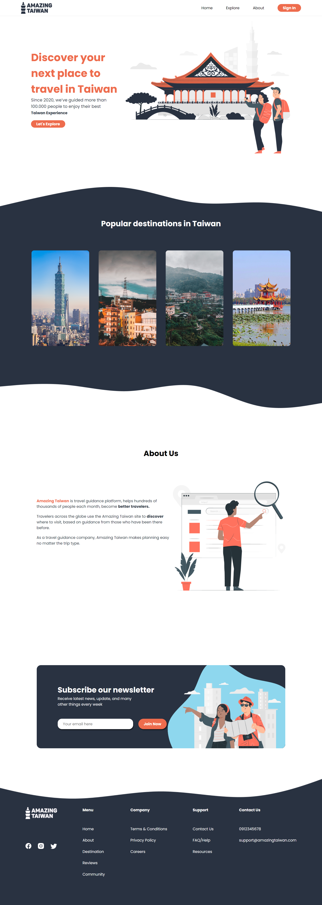

# Travel Agency Landing Page Design

## Description

I created this project to hone and develop my coding abilities. My objective was to replicate a design in Figma as closely as possible to the original design. I used current web development tools and best practices throughout the development process to produce clean, well-structured code. It also gave me the chance to practice with various tools and technologies, such HTML, CSS, and JavaScript. I was able to polish my problem-solving abilities and solidify my grasp of web development concepts by concentrating on attention to detail and creating a faithful reproduction of the original design.

## Table of Contents

- [Screenshots](#screenshots)
- [Installation and Usage](#installation-and-usage)
- [Technologies Used](#technologies-used)
- [Contributing](#contributing)
- [License](#license)

## Screenshots

## Installation and Usage

To run this project locally, you can follow these steps:

1. Clone the repository: `git clone https://github.com/example/travel-agency-landing-page.git`
2. Navigate to the project directory: `cd travel-agency-landing-page`
3. Open the `index.html` file in your web browser.

## Technologies Used

The website was built using the following technologies:

- **HTML:** The website's content and structure were created using HTML.
- **CSS:** The website's styles were defined using CSS.
- **JavaScript:** Some interactive elements on the website, such as the subscription form, were created using JavaScript.
- **Vercel:** The website is hosted on Vercel, a cloud hosting platform for static websites.

## Contributing

Contributions are welcome! If you would like to contribute to the project, please fork the repository and submit a pull request.

## License

This project is licensed under the [MIT License](https://opensource.org/licenses/MIT).

## Contact and Credits

This project was created by **Aldas Kasputis.**

- LinkedIn: [https://www.linkedin.com/in/aldas-k-2ab99b1b4/]
- GitHub: [https://github.com/aldask]

If you have any questions or feedback, feel free to reach out to me through one of these channels. Thank you for checking out my project!
